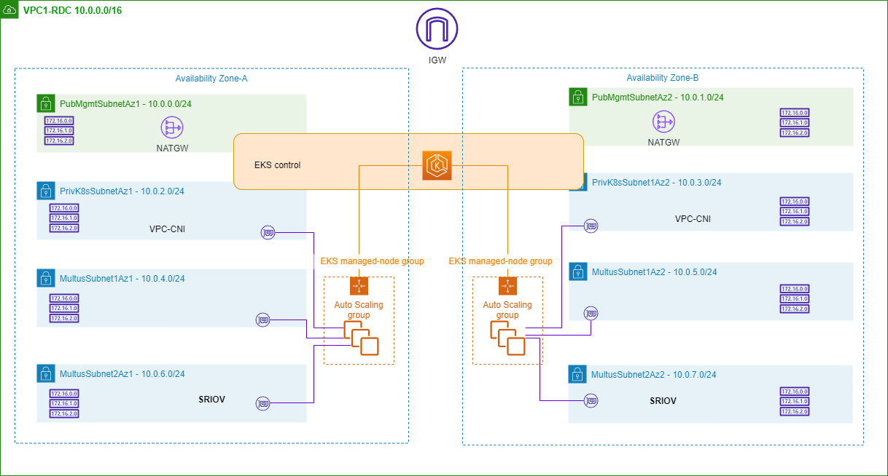

# Telco Network Builder (TNB) deployment test procedure (SRIOV)

This repo contains sample packages for **Telco Network Builder (TNB)** tests and procedures to deploy some demo NFs (with multus networks) using TNB. Following architecture is being implemented and tested in this setup using Telco Network Builder ([TNB](https://console.aws.amazon.com/tnb/)). In this test procedure, we shall deploy 2 Demo Network Functions (NF's) on a EKS cluster containing 2 EKS Managed NodeGroup (with 1 Multus IPv4 subnet and another Multus for SRIOV DPDK) in each Availability zone. SRIOV implementation is based on the [blog post article](https://aws.amazon.com/blogs/industries/automate-packet-acceleration-configuration-using-dpdk-on-amazon-eks/).



## Pre-Requisite

Using Cloudformation - please create IAM roles needed for TNB using the CloudFormation template [tnb-iam-roles.yaml](tnb-iam-roles/tnb-iam-roles-sriov.yaml) (Please note - for SRIOV there are some additional policies added to the TnbEksNodeRole IAM role).
This CloudFormation template creates IAM roles for EKS Cluster, EKS Node Role for EKS Managed Node Group, Multus Role and LifecycleHook role.
Please note these artifacts use AWS "us-west-2" region, kindly update the NSD file with the desired region of your choice, Availability Zones (two) and your [SSH Keypair](https://docs.aws.amazon.com/AWSEC2/latest/UserGuide/create-key-pairs.html) name.
Additionally the [hook scripts](./Network-Package/hooks/postCreate.sh) must be adjusted to your environment (e.g. region) to execute the appropriate post steps.

Upload the files in [dpdk-script](./dpdk-scripts/) folder to a S3 bucket and ensure this S3 bucket name is referenced in the [userData script](./Network-Package/scripts/customUserData.sh) S3BucketName parameter.
Please note the SRIOV multus interface configurations are done via the [userData script](./Network-Package/scripts/customUserData.sh), thus please ensure to modify the interface index, count, CPUAffinity and IRQ_BANNED_CPU parameter configurations for your chosen instance type & configuration.

## Test Procedure

1. Create a zip archive of the content of [Function-Package-NF1 folder](./Function-Package-NF1/) to a zip file e.g. Function-Package-CSAR-NF1.zip. Similarly create a zip archive of the content of [Function-Package-NF2 folder](./Function-Package-NF2/) to a zip file e.g. Function-Package-CSAR-NF2.zip and then create a zip archive of the content of [Network-Package folder](./Network-Package/) to a zip file e.g. Network-Package.zip. Please ensure while creating the zip files - the vnfd.yaml/Artifacts and nsd.yaml/Artifacts are in the root directory of the corresponding Function-Package and Network-Package zip files.

2. Create 2 Function Packages on TNB using ***Function-Package-CSAR-NF1.zip*** and ***Function-Package-CSAR-NF2.zip*** zip archives created in the previous step.
   To create the Function Package using AWS Console, navigate to Telco Network Builder -> Function Packages -> Create Function Package   -> Select the CSAR zip file -> Next and then Create.

   To create the Function packages using AWS CLI (e.g from Cloud9) - please use the following CLI commands -

   ```sh
   AWS_REGION=$(curl -s 169.254.169.254/latest/dynamic/instance-identity/document | jq -r '.region')
   fp1_id=$(aws tnb create-sol-function-package | jq -r '.id')

   aws tnb put-sol-function-package-content \
   --vnf-pkg-id ${fp1_id} \
   --content-type application/zip \
   --file "fileb://Function-Package-NF1.zip" \
   --endpoint-url "https://tnb.${AWS_REGION}.amazonaws.com" \
   --region ${AWS_REGION}
   ```

   ```sh
   fp2_id=$(aws tnb create-sol-function-package | jq -r '.id')

   aws tnb put-sol-function-package-content \
   --vnf-pkg-id ${fp2_id} \
   --content-type application/zip \
   --file "fileb://Function-Package-NF2.zip" \
   --endpoint-url "https://tnb.${AWS_REGION}.amazonaws.com" \
   --region ${AWS_REGION}
   ```

3. Create Network Package on TNB using ***Network-Package-CSAR.zip*** (created in Step 1) that contains the Network Service Descriptor (NSD) containing the AWS Infra and NF Helm deployment. To create the Network package using AWS console, navigate to Telco Network Builder -> Network Packages -> Create Network Package -> Select the CSAR zip file -> Next -> validate the parameter values and then select Create.

   To create the Network package using AWS CLI (e.g from Cloud9) - please use the following CLI commands -

   ```sh
   np_id=$(aws tnb create-sol-network-package  | jq -r '.id')
   aws tnb put-sol-network-package-content --nsd-info-id $np_id --content-type application/zip --file "fileb://Network-Package.zip" --region ${AWS_REGION} --endpoint-url  "https://tnb.${AWS_REGION}.amazonaws.com"
   ```

4. Select the created Network Package and "Create Network Instance"

   To create a Network instance using AWS CLI (e.g from Cloud9) - please use the following CLI commands -

   ```sh
   ni_id=$(aws tnb create-sol-network-instance --nsd-info-id $np_id --ns-name "My-Network1" --ns-description "Network Instance1 for the Sample NF" | jq -r '.id')
   ```

5. Select the created Network Instance and select "Actions -> Instantiate" to start deployment of the Network Instance, i.e. creation of AWS infra (can be seen in CloudFormation), execute post-steps defined in the hook scripts in the Network package -  WhereAbouts installation, NAD creation & LB controller installation and finally the corresponding NF deployments (helm install of NF packages). At this step - ensure the Availability Zones are per your AWS region and SSH Keypair name is one created in the Pre-requisites module.

   To instantiate the Network instance using AWS CLI (e.g from Cloud9) - please use the following CLI commands -

   ```sh
   aws tnb instantiate-sol-network-instance --ns-instance-id $ni_id
   ```

6. Connect to the Cloudshell/Cloud9 and then install the kubectl, helm and other tools using the following commands -

   ```sh
   sudo curl --silent --location -o installK8sTools.sh https://raw.githubusercontent.com/sudhshet/myAwsRepo/main/installK8sTools.sh
   sudo chmod +x installK8sTools.sh
   ./installK8sTools.sh
   ```

   ```sh
   eksCluster=`eksctl get cluster |grep tnbEksClusterni| awk '{print $1}'`
   aws eks update-kubeconfig --region ${AWS_REGION} --name $eksCluster
   ```

7. Check if NF pods & SRIOV Device plugin pods are running on the cluster after the Network Instance instantiation is completed -

   ```sh
   kubectl get pods -A
   ```

   Output of the command should be as follows -

   ```sh
   [cloudshell-user@ip-10-130-40-1 ~]$ kubectl get pods -A
   NAMESPACE     NAME                                                        READY   STATUS    RESTARTS        AGE
   default       tnbdemonf1ni0370861f2295f97c2-multitool-78fb8bd88d-k2d2w    1/1     Running   0               5m9s
   default       tnbdemonf1ni0370861f2295f97c2-multitool-78fb8bd88d-vjclv    1/1     Running   0               5m9s
   default       tnbdemonf1ni0370861f2295f97c2-nginx-66c9677678-ghr84        1/1     Running   0               5m9s
   default       tnbdemonf1ni0370861f2295f97c2-nginx-66c9677678-r8zdr        1/1     Running   0               5m9s
   default       tnbdemonf1ni0370861f2295f97c2-sctpserver-fdfd66856-b6wlb    1/1     Running   0               5m9s
   default       tnbdemonf1ni0370861f2295f97c2-sctpserver-fdfd66856-m5xhr    1/1     Running   0               5m9s
   default       tnbdemonf2ni0370861f2295f97c2-multitool-5d4955d655-jgw49    1/1     Running   0               4m55s
   default       tnbdemonf2ni0370861f2295f97c2-multitool-5d4955d655-xfhp2    1/1     Running   0               4m55s
   default       tnbdemonf2ni0370861f2295f97c2-nginx-5c9444d69b-cjmt9        1/1     Running   0               4m55s
   default       tnbdemonf2ni0370861f2295f97c2-nginx-5c9444d69b-drcbw        1/1     Running   0               4m55s
   default       tnbdemonf2ni0370861f2295f97c2-sctpserver-5ddfcd56c5-797bb   1/1     Running   0               4m55s
   default       tnbdemonf2ni0370861f2295f97c2-sctpserver-5ddfcd56c5-pvm64   1/1     Running   0               4m55s
   kube-system   aws-load-balancer-controller-87d79dbb9-82fmq                1/1     Running   0               5m37s
   kube-system   aws-load-balancer-controller-87d79dbb9-sp7rl                1/1     Running   0               5m37s
   kube-system   aws-node-6djll                                              2/2     Running   2 (5m45s ago)   8m28s
   kube-system   aws-node-v9gmz                                              2/2     Running   2 (5m46s ago)   8m41s
   kube-system   coredns-5b8cc885bc-5f4rg                                    1/1     Running   1 (5m46s ago)   13m
   kube-system   coredns-5b8cc885bc-cz8lx                                    1/1     Running   1 (5m46s ago)   13m
   kube-system   ebs-csi-controller-778ccdc94d-bfdlp                         6/6     Running   6 (6m10s ago)   11m
   kube-system   ebs-csi-controller-778ccdc94d-hzlqw                         6/6     Running   6 (6m10s ago)   11m
   kube-system   ebs-csi-node-5nq9s                                          3/3     Running   3 (5m45s ago)   8m28s
   kube-system   ebs-csi-node-s27m8                                          3/3     Running   3 (6m10s ago)   8m41s
   kube-system   kube-multus-ds-7vf27                                        1/1     Running   2 (6m10s ago)   6m59s
   kube-system   kube-multus-ds-g6vnm                                        1/1     Running   2 (5m45s ago)   6m59s
   kube-system   kube-proxy-rdxxb                                            1/1     Running   1 (5m45s ago)   8m28s
   kube-system   kube-proxy-w4jnf                                            1/1     Running   1 (5m46s ago)   8m41s
   kube-system   kube-sriov-device-plugin-amd64-lfxpc                        1/1     Running   0               5m43s
   kube-system   kube-sriov-device-plugin-amd64-n25j9                        1/1     Running   0               5m43s
   kube-system   whereabouts-979nn                                           1/1     Running   0               6m2s
   kube-system   whereabouts-vp8dg                                           1/1     Running   0               6m2s
   ```

8. Validate if SRIOV configurations are reflected on the EKS worker nodes using the following commands -

   ```sh
   [cloudshell-user@ip-10-130-40-1 ~]$ kubectl get nodes
   NAME                                       STATUS   ROLES    AGE     VERSION
   ip-10-0-2-212.us-west-2.compute.internal   Ready    <none>   9m37s   v1.29.0-eks-5e0fdde
   ip-10-0-3-26.us-west-2.compute.internal    Ready    <none>   9m24s   v1.29.0-eks-5e0fdde
   ```

   ```sh
   [cloudshell-user@ip-10-132-52-148 ~]$ kubectl get node -o yaml ip-10-0-2-212.us-west-2.compute.internal | yq '.status.allocatable'
   cpu: 15890m
   ephemeral-storage: "18242267924"
   hugepages-1Gi: 8Gi
   hugepages-2Mi: "0"
   intel.com/intel_sriov_netdevice_1: "1"
   memory: 53387784Ki
   pods: "234"
   [cloudshell-user@ip-10-132-52-148 ~]$ kubectl get node -o yaml ip-10-0-3-26.us-west-2.compute.internal | yq '.status.allocatable'
   cpu: 15890m
   ephemeral-storage: "18242267924"
   hugepages-1Gi: 8Gi
   hugepages-2Mi: "0"
   intel.com/intel_sriov_netdevice_1: "1"
   memory: 53387784Ki
   pods: "234"
   ```

## Cleanup

To cleanup the environment via AWS Console, go to Telco Network Builder

1. Navigate to Networks, select the Network Instance ID -> Actions -> Terminate. Confirm by copying the Network instance id.
2. Once the termination is complete, delete the Network Instance by selecting Actions -> Delete
3. To delete the Network package, it has to be disabled first, select Network Packages -> Select the Network Package ID -> Actions -> Disable
4. Delete the Network package by selecting Network Packages -> Select the Network Package ID -> Actions -> Delete
5. To delete each of the Function packages, it has to be disabled first, select Function Packages -> Select the Function Package ID -> Actions -> Disable
6. Delete the Function packages by selecting Function Packages -> Select the Function Package ID -> Actions -> Delete

To cleanup the environment using AWS CLI - use the following commands -

```sh
# Terminate Network Instance
aws tnb terminate-sol-network-instance --ns-instance-id $ni_id

# Delete Network Instance
aws tnb delete-sol-network-instance --ns-instance-id $ni_id

# Disable Network Package
aws tnb update-sol-network-package --nsd-info-id $np_id --nsd-operational-state DISABLED

# Delete Network Package
aws tnb delete-sol-network-package \
--nsd-info-id $np_id \
--endpoint-url "https://tnb.${AWS_REGION}.amazonaws.com" \
--region ${AWS_REGION}

# Disable Function Package1
aws tnb update-sol-function-package --vnf-pkg-id $fp1_id --operational-state DISABLED

# Delete Function Package1
aws tnb delete-sol-function-package \
--vnf-pkg-id $fp1_id \
--endpoint-url "https://tnb.${AWS_REGION}.amazonaws.com" \
--region ${AWS_REGION}

# Disable Function Package2
aws tnb update-sol-function-package --vnf-pkg-id $fp2_id --operational-state DISABLED

# Delete Function Package2
aws tnb delete-sol-function-package \
--vnf-pkg-id $fp2_id \
--endpoint-url "https://tnb.${AWS_REGION}.amazonaws.com" \
--region ${AWS_REGION}
```

Delete the CloudFormation stack that created the IAM roles needed for TNB.
